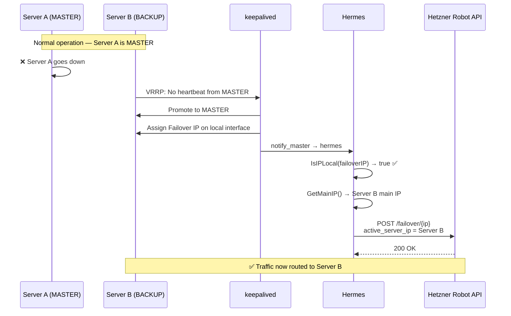

# Hermes

Hetzner Failover IP Monitor - Automatically updates failover IP routing via Hetzner Robot API.

Hermes is a small Go utility designed to be used with `keepalived` (or similar VRRP tools). It monitors if a failover IP is assigned to the local machine and ensures that the Hetzner Robot API is updated to route traffic to the current node.


## How it Works

In a Hetzner bare-metal setup, failover IPs require **both** Layer 2 (VRRP) and Layer 3 (API) updates. `keepalived` handles VRRP between your servers, and Hermes bridges the gap by notifying Hetzner's routing infrastructure.



> **Why is the API call needed?** `keepalived` only manages the VIP at the OS/network level between your servers. Hetzner's datacenter routing is separate — without the Robot API call, external traffic would still be sent to the old server.

## Build

```bash
make build
```

## Configuration

Create a JSON configuration file (default: `/home/nixos/robot.json`):

```json
{
  "user": "your_hetzner_user",
  "password": "your_hetzner_password",
  "failover_ip": "203.0.113.1"
}
```

### Environment Variables

Environment variables override settings in the JSON file:

- `HETZNER_USER`
- `HETZNER_PASS`
- `FAILOVER_IP`
- `MAIN_IP` (optional, auto-detected if not set)

## Usage

```bash
# Normal run
./hermes

# Using a custom config file
./hermes --config /path/to/config.json

# Enable verbose logging
./hermes --verbose

# Dry run (test without API calls)
./hermes --dry-run --verbose
```

## Keepalived Integration

Add to your `keepalived.conf`:

```bash
vrrp_instance VI_1 {
    # ...
    notify_master "/usr/local/bin/hermes --config /etc/hermes/robot.json"
}
```

## Development

This project uses `devenv` for a reproducible development environment.

```bash
devenv shell
make test
```

### Makefile Commands

- `make build`: Build the binary.
- `make test`: Run unit tests.
- `make lint`: Run golangci-lint.
- `make clean`: Clean build artifacts.
- `make run-dry`: Run in dry-run mode.

## License

See [LICENSE](LICENSE).
